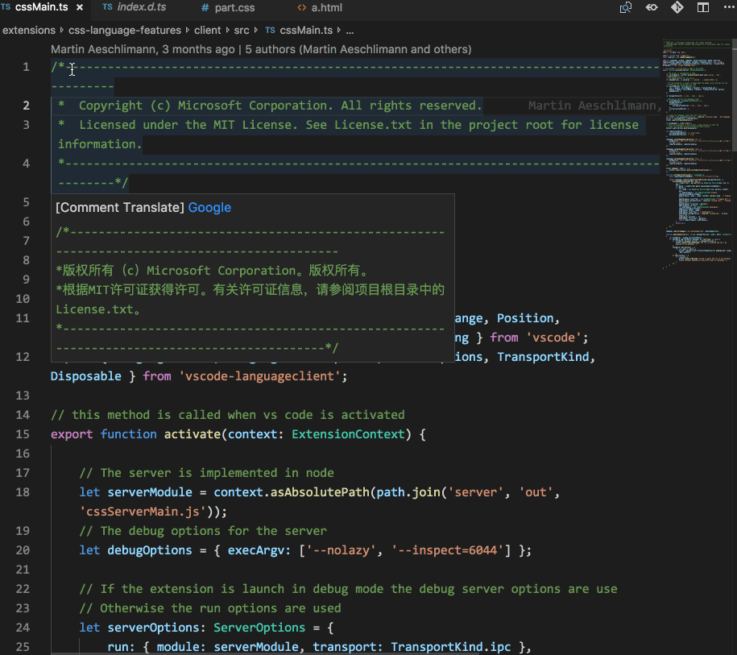
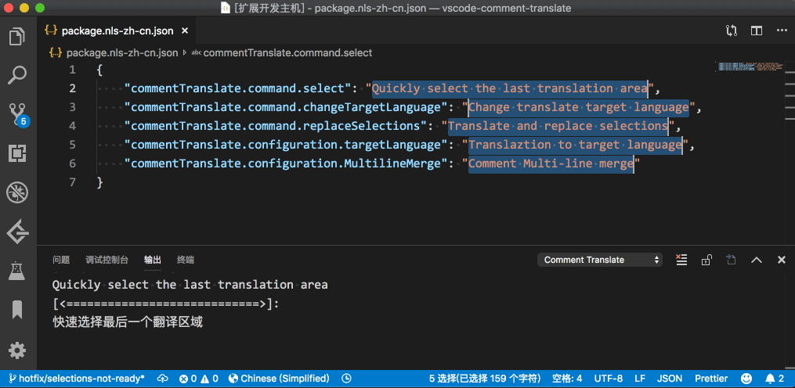
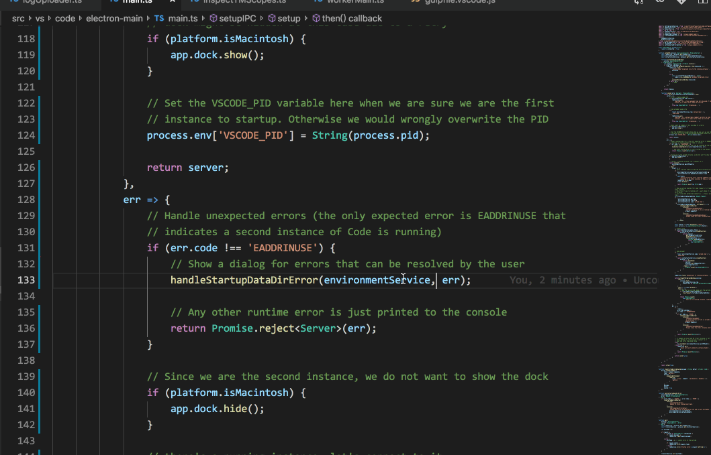

# VSCode 注释翻译

## 简介

许多优秀的项目，都有丰富的注释，使用者可以快速理解代码意图。但是如果使用者并不熟习注释的语言，会带来理解困难。本插件使用 Baidu Translate API 翻译 VSCode 的编程语言的注释。

## 功能
1. 识别代码中注释部分，不干扰阅读。支持不同语言，单行、多行注释

2. 支持用户字符串与变量翻译,支持驼峰拆分

3. 选择区域翻译 - 划词翻译

4. 翻译并替换选择内容

5. 选中最后一次翻译区域命令

